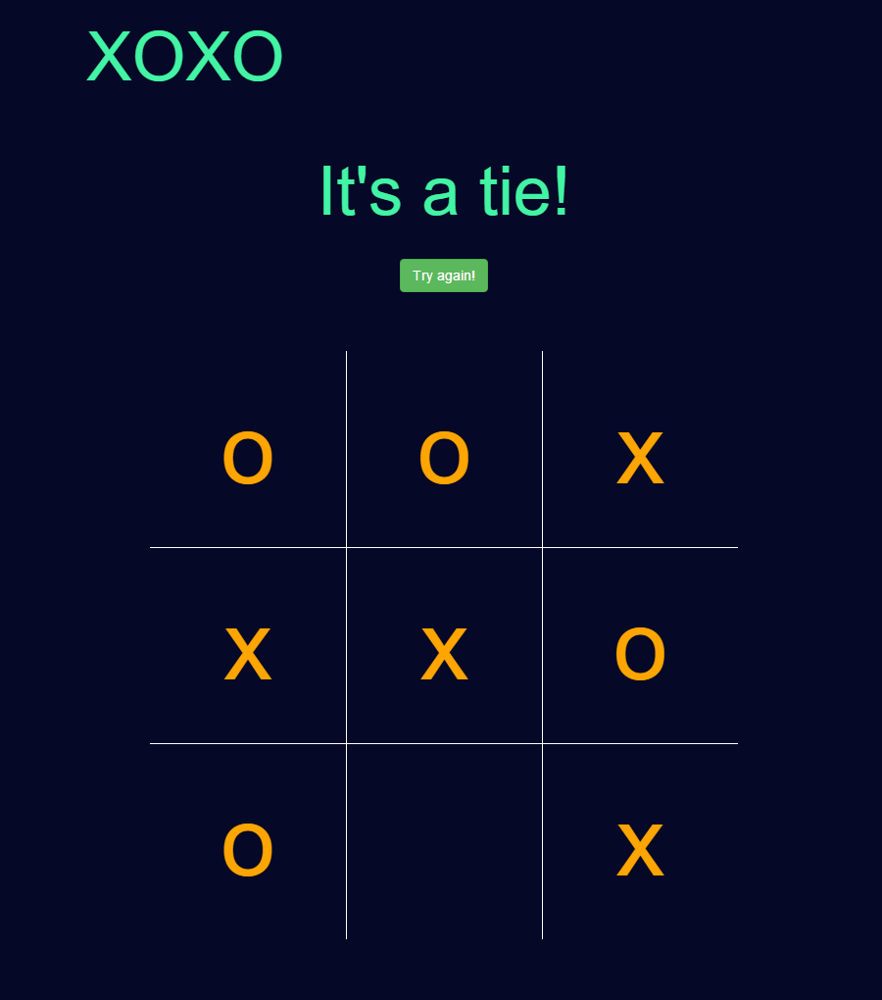

# xoxo
#### [live demo](http://prochal.com/xoxo/)
xoxo is a simple tic toe game prototype with basic functionalities from free code camp. The challenge was to make the AI unbeatable. Initial first version contained hardcoded algorithm for AI based on nested if statements for edge cases and a loop checking winning condition, which grew quite big even for such a small amount of combinations. Luckily, the projects got few peer reviews that eventually led to complete design overhaul resulting in switching to a recursive function. 

The function checks for available spots on the board and defines exit points: 

```
recurIteration++;
    let array = freeSpots(recurBoard);
    if (hasPlayerWon(recurBoard, playerSymbol)) {
        return {
            score: -1
        };
    } else if (hasPlayerWon(recurBoard, compSymbol)) {
        return {
            score: 1
        };
    } else if (array.length === 0) {
        return {
            score: 0
        };
    }
```

Then checks all possible scenarios by creating new boards for every step and invoking itself again in that state. 

```
let moves = [];
    for (let i = 0; i < array.length; i++) {
        let move = {};
        move.index = recurBoard[array[i]];
        recurBoard[array[i]] = player;

        if (player == compSymbol) {
            let g = minMax(recurBoard, playerSymbol);
            move.score = g.score;
        } else {
            let g = minMax(recurBoard, compSymbol);
            move.score = g.score;
        }
        recurBoard[array[i]] = move.index;
        moves.push(move);
    }
```

It's a simple minmax algorithm that assumes worst possible scenario (minimizing) for player moves and maximizing ai chance of winning for each iteration.

Also in v1.1 UI was fixed for mobile devices.




